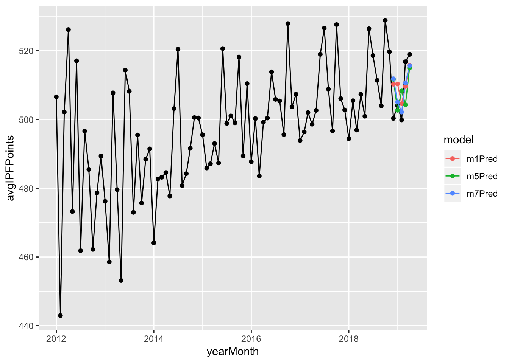
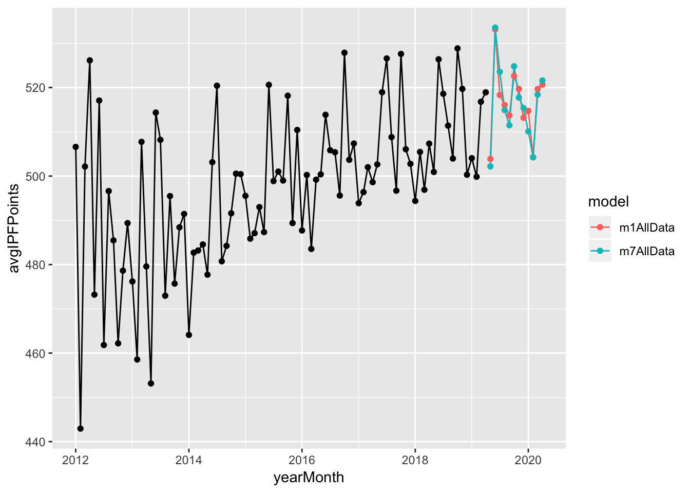
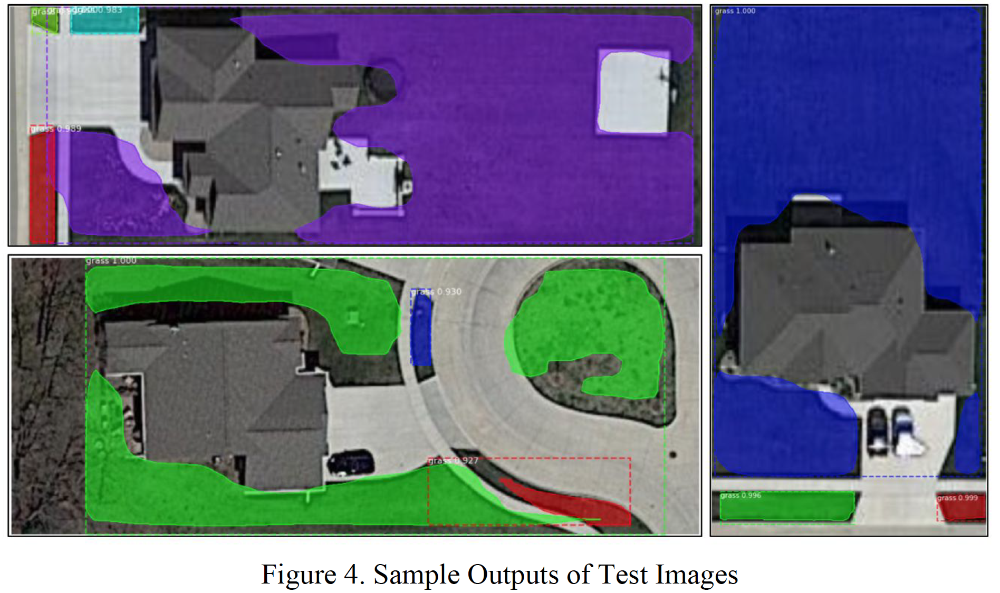
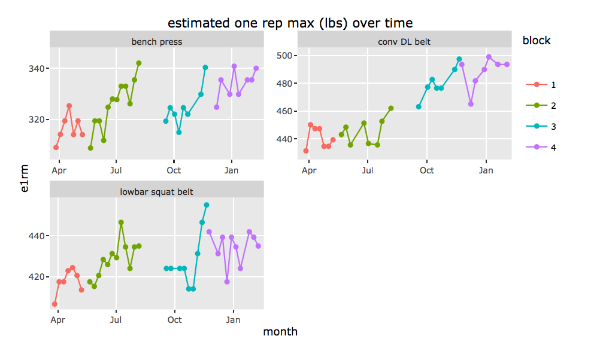

# Matt's Portfolio
20-30 second overview of each project. Use this to navigate through all my projects.

## Predicting strength changes in the powerlifting population over time using ARIMA models
#### Read the report [here](https://matthewnaples.github.io/powerlifting_TSA/)
#### View code at the original repo [here](https://github.com/matthewnaples/powerlifting_TSA/) 
* Using arima forecasting, I predict change in the powerlifting population over time with a Mean Absolute Error of ~ 5 IPF-points, which can be interpreted as approximately 80 pounds difference in total weight lifted across all three lifts (for a 185 pound male).
* The following is visual comparison between a few tentative ARIMA models and the ground truth of unseen data:

* After selecting two of the best models, I forecasted one year into the future (waiting on the results from the data source to be updated to validate this):

* This data uses the powerlifting competition scores from hundreds of thousands of powerlifters.

## Identifying lawns from Satellite Images of Properties Using Mask R-CNN
#### Read the report [here](https://github.com/matthewnaples/Lawn_maskRCNN/blob/master/Final%20Report%20-%20Geospatial%20Object%20Detection.pdf)
#### View the python notebook and instructions for running the model [here](https://github.com/matthewnaples/Lawn_maskRCNN)
* Identified lawns with a mean Average Precision (mAP) of 86.02%.

* Adopted [Matterport Inc's implementation](https://github.com/matterport/Mask_RCNN) of Mask R-CNN as our implementation.
* used image augmentation to overcome sample size barriers (only 85 original images).

## Using property information to predict airbnb price listings
#### Read the report [here]()
#### View the code [here](https://github.com/matthewnaples/Lawn_maskRCNN)
* 
*
*

## Using Reisistance Training Data to Facilitate Strength Progression.
#### Read the project report [here](https://matthewnaples.github.io/Individual_Strength_Analysis/)
#### View the repository with code  [here](https://github.com/matthewnaples/Individual_Strength_Analysis)
* I captured over a year of my weight training data in hopes of increasing my squat, bench press, and deadlift strength.
* As a result of the analysis, I put 30 pounds on my bench press (310-340 lbs) , 50 pounds on my squat (405-455) , and about 65 pounds on my deadlift (430-495)  after nearly a year of stagnation.
* The process was as follows: I followed an 8-10 week program (also called a block), analyzed the results of the training block, updated a few parameters of it (volume per week, average intensity per week, week to week variability in intensity, and week to week variability in volume), then followed the updated version for 8-10 more weeks. There were a total of four blocks performed. Here are the results:

* As you can see, block 1 was an experimental block without much results, but the insights from block 1 lead to stellar increases in strength in blocks 2 and 3. Block 4 was another experimental block like block 1, and insights were taken from it that did lead to training improvement after cessation of data collection.
* No formal statistical modeling was used for the following reasons: (1) I'm not estimating population parameters; (2) time series forecast is useless, as I am knowingly going to manipulate causal factors that will change the process governing that forecast; (3) formal experimental design is untennable.

